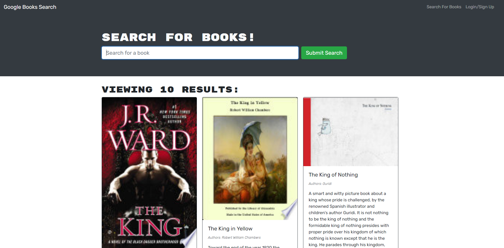

# Backend-Refactor

## Table of contents
​
- [General info](#General-Info)
- [Technologies](#Technologies)
- [Containers](#Containers)
- [Deployment](#Deployment)
- [Code Overview](#Code-Overview)
- [Summary](#Summary)
- [CSS style](#CSS-style)
- [Routing Explained](#Routing-Explained)
​
​
## General-Info
​
This is an application that searches for books by title and displays information associated with them, as well as a cover illustration.  It uses a google api to search for the related title
​
Deployed link: 
​
Landing page 
​

​
## Technologies
​
Project is created with:
​
- [React](https://reactjs.org/)
- [JavaScript](https://www.javascript.com/)
- [Bootstrap](https://getbootstrap.com/)
- [Node.js](https://nodejs.org/)
- [Express.js](https://expressjs.com/)
- [MongoDb](https://www.mongodb.com/)
- [Mongoose](https://mongoosejs.com/)
- [Bcrypt.js](https://www.npmjs.com/package/bcrypt)

- note* this is a refactor and may contain unused code

​
## Deployment
​
Download the repository
​
- Copy the repo
- In your terminal, cd to the CRM folder directory, `$npm i`
- To run on browser: `npm start`
- You can also use the heroku-link for a demo:
- Deployed link: 
​
## Code Overview
​
- Basic overview
​
## Summary
​
- This project is a mock-CRM for a start-up/small brewery company. 
​
## CSS style
​
- This part we explain the CSS style 
​
​
## Routing-Explained
​
- Routing 
​

​
## Authors
​
- John Doe
- Jane Doe
​
## License
​
- Open Source